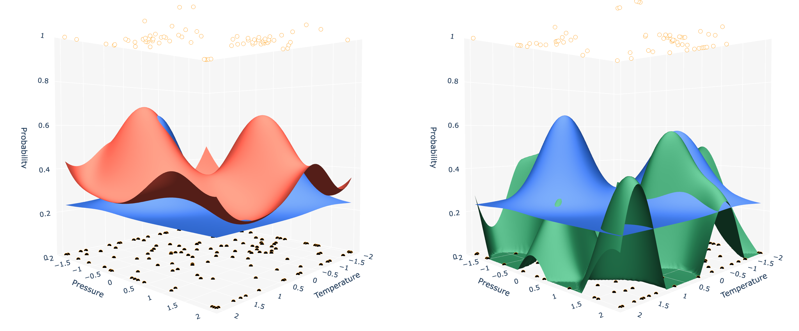

# High Expectation vs UCB



This folder contains a small set of notebooks exploring the relationship between a high-expectation strategy and GP-UCB-style acquisition functions. The main example combines a synthetic binary outcome model, Gaussian-process-based surrogates, and visual comparisons between exploration strategies.

## Contents

- [highexp-vs-ucb.ipynb](highexp-vs-ucb.ipynb): background notes and a 1D Gaussian-process regression example.
- [highexp-vs-ucb-example.ipynb](highexp-vs-ucb-example.ipynb): the main 2D notebook with the binary outcome toy problem, sequential sampling, and visualizations.
- [requirements.txt](requirements.txt): Python packages used by the notebooks.

### Why High Expecation is nice

- MAP often more efficient to calculate than MAP + variance.
- Can just use MLE (equiv. to MAP with uniform prior) with a high 'prior mean' and get rid of Bayesian treatment altogether. E.g. neural network with he initialization (expected mean = 0) and then add a fixed offset to the output.
- With e.g. linear kernel learning can still make global adjustments to the mean.
- High expectation can pull towards higher mode of multimodal posterior?

## Run the notebooks

### Binder

Click the Binder badge below to launch the main notebook in a hosted environment.

[](https://mybinder.org/v2/gh/PaulEibensteiner/highexp-vs-ucb/HEAD?urlpath=%2Fdoc%2Ftree%2Fhighexp-vs-ucb-example.ipynb)

### Local setup

1. Create a virtual environment.
2. Install the dependencies from [requirements.txt](requirements.txt).
3. Open the notebook in Jupyter or VS Code and run the cells top to bottom.

Example:

```bash
python3 -m venv .env
source .env/bin/activate
python -m pip install -r requirements.txt
```

### Related Literature

[What do you Mean? The Role of the Mean Function in Bayesian Optimisation](https://dl.acm.org/doi/pdf/10.1145/3377929.3398118)

[Greed Is Good: Exploration and Exploitation Trade-offs
in Bayesian Optimisation](https://dl.acm.org/doi/pdf/10.1145/3425501?utm_source=consensus)

[Bayesian Optimization with Informative Covariance](https://scispace.com/pdf/bayesian-optimization-with-informative-covariance-1bv12tcp.pdf)
